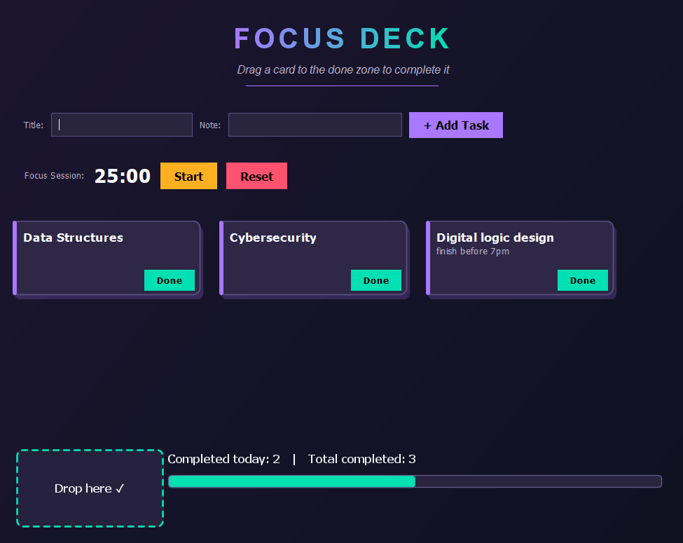
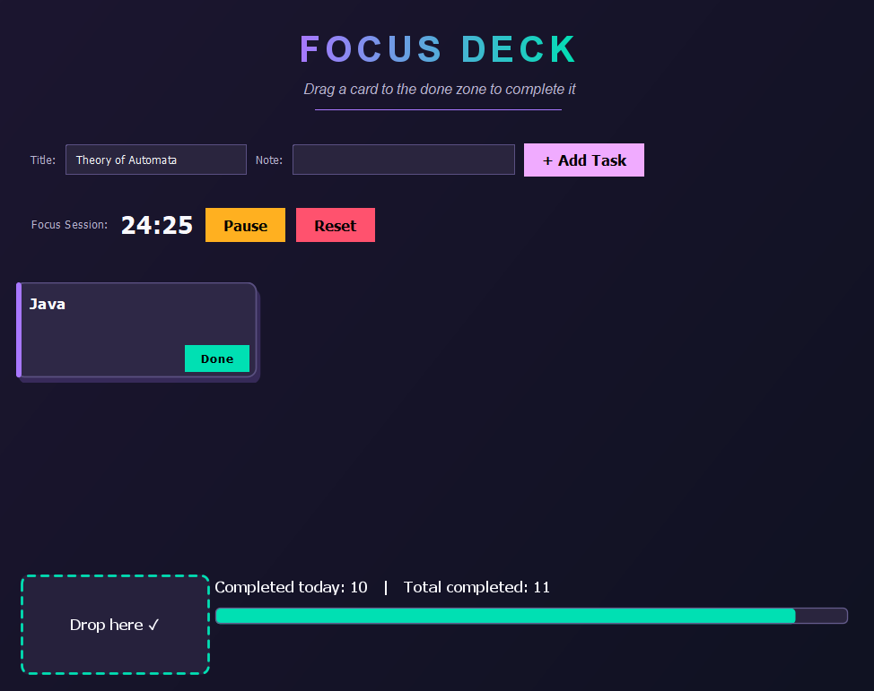

# Focus Deck

A desktop focus and task-management app built in Java Swing. Instead of a flat to-do list, tasks live as draggable cards in a deck, drag a card onto the drop zone to complete it, with a slide and fade animation, or drag cards around to reorder them by priority. A Pomodoro-style session timer runs alongside the deck, and a stats bar tracks completed tasks over time.




## Features

- **Draggable task cards** —> custom-painted with a glowing accent border, no external image assets
- **Add tasks** through a simple form (title + optional note)
- **Drag-to-complete** —> drop a card on the done zone to finish it, animated with `javax.swing.Timer`
- **Drag-to-reorder** —> drop anywhere else in the deck and cards re-sort by position
- **Pomodoro session timer** —> start / pause / reset, 25-minute default focus block
- **Local persistence** —> tasks save to a text file next to the app, so your deck survives a restart
- **Stats bar** —> tasks completed today, total completed, and a live progress bar
- **Custom dark UI** —> gradient background, gradient-text header, and a hand-built color palette

## Tech stack

- Java 21
- Java Swing (no external UI libraries)
- Maven

## How to run

### From NetBeans
1. Clone or download this repo
2. Open it in NetBeans as an existing Maven project
3. Run `FocusDeck.java` (Run → Run File)

### From the command line
```bash
git clone https://github.com/areebamalik0/FocusDeck.git
cd FocusDeck
mvn compile exec:java -Dexec.mainClass="com.mycompany.focusdeck.FocusDeck"
```

## Project structure

```
FocusDeck/
  src/main/java/com/mycompany/focusdeck/
    FocusDeck.java       # Entry point, window layout, gradient background/header
    Task.java             # Task data model + text-based (de)serialization
    TaskStorage.java        # Load/save tasks to a local file
    TaskCard.java             # Draggable, custom-painted card component
    DeckPanel.java              # Card layout, drag/reorder/complete logic
    DoneZonePanel.java            # Drop target that completes a task
    AddTaskPanel.java               # Form for adding new tasks
    TimerPanel.java                   # Pomodoro-style countdown timer
    StatsPanel.java                     # Completed-count + progress bar
  pom.xml
  .gitignore
  README.md
```

## Roadmap 

- Swap the plain text save file for a real database (SQLite)
- Add task categories or color tags
- Add a settings panel for custom timer lengths
- Package as a runnable `.jar` or native installer

## License

© 2026 Areeba Malik. All rights reserved.

This project is shared publicly for portfolio and educational purposes only. You're welcome to view, read, and study the code. You may **not** copy, redistribute, modify, sublicense, or sell this project or any part of it, in source or compiled form, without explicit written permission from the author.

## Author

**Areeba Malik**
GitHub: [@areebamalik0](https://github.com/areebamalik0)
